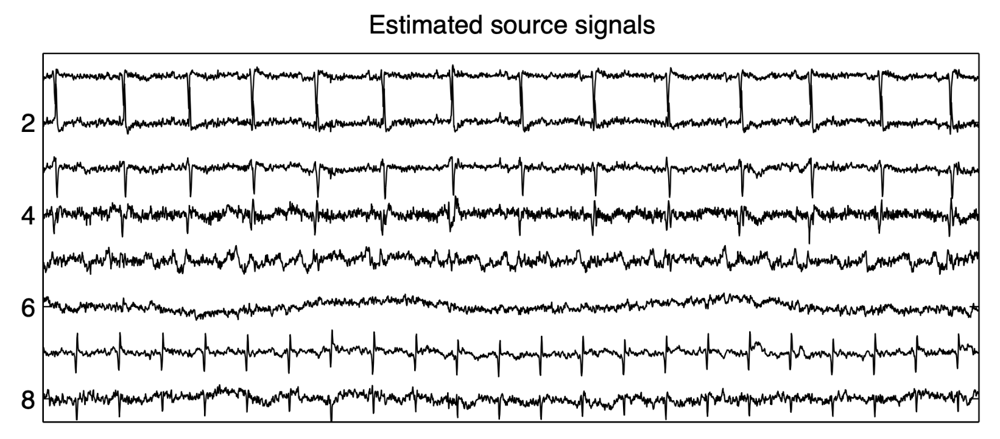

# ICAforECGrecordings

[](https://Tim-Mueller-Bagehl.github.io/ICAforECGrecordings.jl/stable/)
[](https://Tim-Mueller-Bagehl.github.io/ICAforECGrecordings.jl/dev/)
[](https://github.com/Tim-Mueller-Bagehl/ICAforECGrecordings.jl/actions/workflows/CI.yml?query=branch%3Amain)
[](https://codecov.io/gh/Tim-Mueller-Bagehl/ICAforECGrecordings.jl)

# Blind Source Separation of ECG Recordings using ICA

This project analyzes a dataset of cutaneous ECG potential recordings from a pregnant woman, sourced from the SISTA DaISy database.

The main goal is to **separate the heartbeats of the mother and the fetus**. 

To achieve this, we implement several **Independant Component Analysis (ICA)** algorithms such as **JADE**, **Shibbs**, and **Picard**, and apply them to the recordings. The results will be visualized once the signal separation is completed.



---

## Dataset

We use the **SISTA DaISy database**:

- **Dataset**: [foetal_ecg.dat.gz](https://ftp.esat.kuleuven.be/pub/SISTA/data/biomedical/foetal_ecg.dat.gz)

---

## ICA Algorithms Implemented

| Algorithm | Description | Reference |
|----------|-------------|-----------|
| **JADE** | Joint Approximate Diagonalization of Eigenmatrices | [Cardoso, ICASSP 1998](https://www2.iap.fr/users/cardoso/RRicassp98.html) |
| **Shibbs** | Higher-order cumulant-based ICA | [JnS Toolbox](https://www2.iap.fr/users/cardoso/code/JadeC/JnS.tar) |
| **Picard** | Fast ICA under orthogonal constraint | [Picard on GitHub](https://github.com/pierreablin/picard/blob/master/matlab_octave/picardo.m) |

---

## References

- Cardoso, J.-F., “Blind signal separation: statistical principles”, [Neural Computation, 1998](http://www2.iap.fr/users/cardoso/papers/neuralcomp_2ppf.pdf)
- De Moor B.L.R., DaISy: Database for the Identification of Systems, KU Leuven
- Domino, K. et al., "Efficient Computation of Higher-Order Cumulant Tensors", SIAM J. Sci. Comput. 40, A1590 (2018)
- Picard ICA Algorithm: [GitHub - pierreablin/picard](https://github.com/pierreablin/picard)


---

## Isntallation/Usage Guide

```
julia
pkg> add https://github.com/Tim-Mueller-Bagehl/ICAforECGrecordings

using ICAforECGrecordings
using DelimitedFiles
data = ReadDatasetFromDatFile("data/foetal_ecg.dat")
plot_dataset(data)
```

---